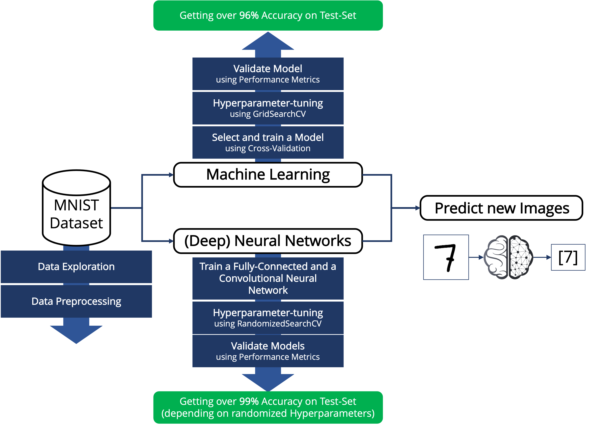

# Hands-On-MNIST-Using-ML-DL

This repository serves as an example of a data science project using the MNIST dataset. The goal is to predict digits based on 70,000 handwritten examples. In this project, we select a machine learning model, train and validate it, and tune its hyperparameters. The model predicts digits with over 96% accuracy.

In addition, we train a (Deep) Neural Network, tune its hyperparameters, and achieve over 97% accuracy (depending on the hyperparameters selected based on RandomizedSearchCV).

The following figure is intended to provide an overview of the topics we will cover:

Further work consists of training a Convolutions Neural Network (CNN) and an Autoencoder for this task.
